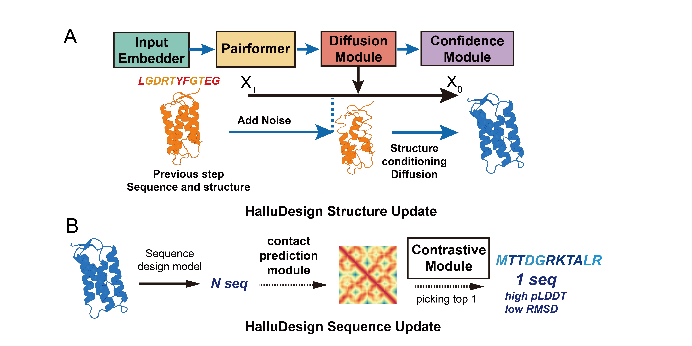

HalluDesign, a hallucination-driven all-atom framework for the iterative co-optimization and co-design of protein sequences and structures by leveraging the forward pass of a structure prediction model

# RUN HalluDesign
## Basic Command

More examples can check in examples/
```
python HalluDesign_run.py 
--input_file <pdbfile> or --pdb_list <pdblist>
--output_dir <outdir> 
--prediction_model <af3 or protenix> 
--template_path <af3 json or protenix json>
--ref_time_steps <HalluDesign diffusion steps, 50 for local optimization, 150 for global optimization and design>
--num_seqs <num sequences per cycle>
--design_epoch_begin <number_of_initial_cycles_to_skip>
--mpnn <ligand_mpnn or protein_mpnn>
--random_init # for from scratch design
```
###
You need to prepare a json file which serve your purpose, protein chain to design should be put in Chain A.
####
Binder design: target should contain MSA and Templates which are in AF3 standard format.
####
PTM binder design requires that the json contains a defined post-translational modifications.
###


###

# Installation

## Singularity

For those can use Singularity, we offer singularity sif file at here.
```
https://doi.org/10.5281/zenodo.17789892
```
## Conda 

### Install AF3
```
git clone https://github.com/MinchaoFang/HalluDesign.git
conda create -n HalluDesign python=3.11 -y
conda activate HalluDesign
cd HalluDesign
conda install -c conda-forge c-compiler cxx-compiler cmake ninja zlib -y
export CFLAGS="-I$CONDA_PREFIX/include"
export CXXFLAGS="-I$CONDA_PREFIX/include"
export LDFLAGS="-L$CONDA_PREFIX/lib"
pip install -r dev-requirements.txt
pip install --no-deps .
build_data
```
### Install HalluDesign-AF3
```
pip install torch==2.6.0 torchaudio==2.6.0 torchvision==0.21.0 numpy==1.23.5 biopython==1.79 prody==2.4.1 pandas==2.2.3  -f https://download.pytorch.org/whl/cu126
pip install ml-collections==0.1.1 transformers==4.50.0 fair-esm==2.0.0 triton==3.1.0
cd LigandMPNN
bash get_model_params.sh "./model_params"
```
### Install HalluDesign-Protenix (Optional)
```
git clone https://github.com/NVIDIA/cutlass.git
```

### If you want to use CoDP (Optional)
Pytorch-based CoDP has GPU memory problem with jax-based AF3, so we use pytorch-based Protenix as our foundationl model.
```
git clone https://github.com/MinchaoFang/CoDP.git
```

# Reference

```bibtex
@article {Fang2025.11.08.686881,
	author = {Fang, Minchao and Wang, Chentong and Shi, Jungang and Lian, Fangbai and Jin, Qihan and Wang, Zhe and Zhang, Yanzhe and Cui, Zhanyuan and Wang, YanJun and Ke, Yitao and Han, Qingzheng and Cao, Longxing},
	title = {HalluDesign: Protein Optimization and de novo Design via Iterative Structure Hallucination and Sequence design},
	elocation-id = {2025.11.08.686881},
	year = {2025},
	doi = {10.1101/2025.11.08.686881},
	publisher = {Cold Spring Harbor Laboratory},
	URL = {https://www.biorxiv.org/content/early/2025/11/09/2025.11.08.686881},
	eprint = {https://www.biorxiv.org/content/early/2025/11/09/2025.11.08.686881.full.pdf},
	journal = {bioRxiv}
}

@article{Abramson2024,
  author  = {Abramson, Josh and Adler, Jonas and Dunger, Jack and Evans, Richard and Green, Tim and Pritzel, Alexander and Ronneberger, Olaf and Willmore, Lindsay and Ballard, Andrew J. and Bambrick, Joshua and Bodenstein, Sebastian W. and Evans, David A. and Hung, Chia-Chun and O’Neill, Michael and Reiman, David and Tunyasuvunakool, Kathryn and Wu, Zachary and Žemgulytė, Akvilė and Arvaniti, Eirini and Beattie, Charles and Bertolli, Ottavia and Bridgland, Alex and Cherepanov, Alexey and Congreve, Miles and Cowen-Rivers, Alexander I. and Cowie, Andrew and Figurnov, Michael and Fuchs, Fabian B. and Gladman, Hannah and Jain, Rishub and Khan, Yousuf A. and Low, Caroline M. R. and Perlin, Kuba and Potapenko, Anna and Savy, Pascal and Singh, Sukhdeep and Stecula, Adrian and Thillaisundaram, Ashok and Tong, Catherine and Yakneen, Sergei and Zhong, Ellen D. and Zielinski, Michal and Žídek, Augustin and Bapst, Victor and Kohli, Pushmeet and Jaderberg, Max and Hassabis, Demis and Jumper, John M.},
  journal = {Nature},
  title   = {Accurate structure prediction of biomolecular interactions with AlphaFold 3},
  year    = {2024},
  volume  = {630},
  number  = {8016},
  pages   = {493–-500},
  doi     = {10.1038/s41586-024-07487-w}
}

@article{bytedance2025protenix,
  title={Protenix - Advancing Structure Prediction Through a Comprehensive AlphaFold3 Reproduction},
  author={ByteDance AML AI4Science Team and Chen, Xinshi and Zhang, Yuxuan and Lu, Chan and Ma, Wenzhi and Guan, Jiaqi and Gong, Chengyue and Yang, Jincai and Zhang, Hanyu and Zhang, Ke and Wu, Shenghao and Zhou, Kuangqi and Yang, Yanping and Liu, Zhenyu and Wang, Lan and Shi, Bo and Shi, Shaochen and Xiao, Wenzhi},
  year={2025},
  journal={bioRxiv},
  publisher={Cold Spring Harbor Laboratory},
  doi={10.1101/2025.01.08.631967},
  URL={https://www.biorxiv.org/content/early/2025/01/11/2025.01.08.631967},
  elocation-id={2025.01.08.631967},
  eprint={https://www.biorxiv.org/content/early/2025/01/11/2025.01.08.631967.full.pdf},
}

@article{dauparas2023atomic,
  title={Atomic context-conditioned protein sequence design using LigandMPNN},
  author={Dauparas, Justas and Lee, Gyu Rie and Pecoraro, Robert and An, Linna and Anishchenko, Ivan and Glasscock, Cameron and Baker, David},
  journal={Biorxiv},
  pages={2023--12},
  year={2023},
  publisher={Cold Spring Harbor Laboratory}
}

@article{dauparas2022robust,
  title={Robust deep learning--based protein sequence design using ProteinMPNN},
  author={Dauparas, Justas and Anishchenko, Ivan and Bennett, Nathaniel and Bai, Hua and Ragotte, Robert J and Milles, Lukas F and Wicky, Basile IM and Courbet, Alexis and de Haas, Rob J and Bethel, Neville and others},
  journal={Science},
  volume={378},
  number={6615},  
  pages={49--56},
  year={2022},
  publisher={American Association for the Advancement of Science}
}
```
# Licence and Disclaimer

## HalluDesign
Halludesign all code are under [MIT license](https://github.com/MinchaoFang/HalluDesign/blob/main/LICENSE) 

## AlphaFold 3 Source Code and Model Parameters

alphafold3 is not an officially supported Google product.

Copyright 2024 DeepMind Technologies Limited.

The AlphaFold 3 source code is licensed under the Creative Commons
Attribution-Non-Commercial ShareAlike International License, Version 4.0
(CC-BY-NC-SA 4.0) (the "License"); you may not use this file except in
compliance with the License. You may obtain a copy of the License at
[https://github.com/google-deepmind/alphafold3/blob/main/LICENSE](https://github.com/google-deepmind/alphafold3/blob/main/LICENSE).

The AlphaFold 3 model parameters are made available under the
[AlphaFold 3 Model Parameters Terms of Use](https://github.com/google-deepmind/alphafold3/blob/main/WEIGHTS_TERMS_OF_USE.md)
(the "Terms"); you may not use these except in compliance with the Terms. You
may obtain a copy of the Terms at
[https://github.com/google-deepmind/alphafold3/blob/main/WEIGHTS_TERMS_OF_USE.md](https://github.com/google-deepmind/alphafold3/blob/main/WEIGHTS_TERMS_OF_USE.md).

## Protenix

The Protenix project including both code and model parameters is released under the [Apache 2.0 License](https://github.com/bytedance/Protenix/blob/main/LICENSE). It is free for both academic research and commercial use.

## LigandMPNN

LigandMPNN are under [MIT license](https://github.com/dauparas/LigandMPNN/blob/main/LICENSE)

