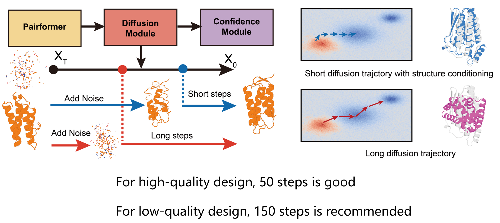
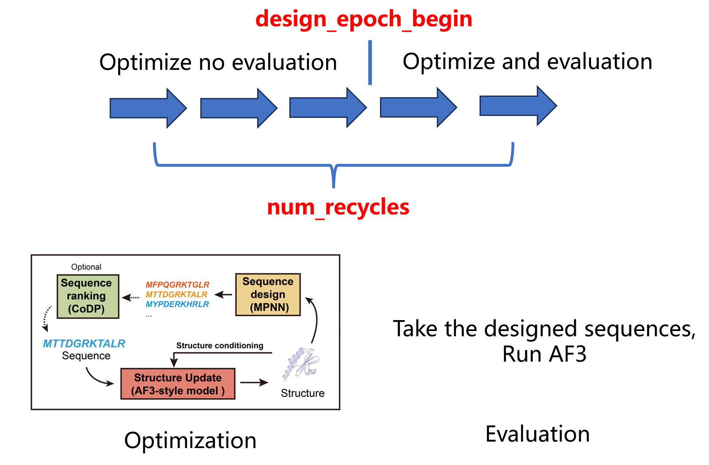

# Input and Output Specification

This document describes the required input format and generated outputs for HalluDesign.

# Input

HalluDesign requires:

- a target structure, or a no-PDB random-init chain specification
- optional ligand / binder information
- design constraints
- sampling configurations

---

## Required Arguments

| Argument | Description |
|----------|-------------|
| `--pdb_list` | Path to a list of input PDB files. Mutually exclusive with `--input_file` and `--random_init_chain_spec`. |
| `--input_file` | Input structure file (`.pdb`). All residue indices should begin with **1**. Mutually exclusive with `--pdb_list` and `--random_init_chain_spec`. |
| `--output_dir` | Output directory. A CSV file containing all results will be generated here. |
| `--HalluDesign_model` | model for design. Options: `af3`, `Protenix`, or `cross_model`. |
| `--template_path` | Template structure used during optimization. The protein chain should be placed **first**. |
| `--design_epoch_begin` | Starting epoch for design optimization. |
| `--num_recycles` | Number of recycles during structure refinement. |
| `--ref_time_steps` | Number of refinement diffusion time steps. |

One of `--input_file`, `--pdb_list`, or `--random_init_chain_spec` must be provided.

## Optional Arguments
| Argument | Description |
|----------|-------------|
| `--template_for_eval` | Template JSON file used for evaluation. |
| `--extra_json_path` | Additional JSON files required for cross-model mode (for both Protenix and AF3). |
| `--sm` | Input ligand as a SMILES string. |
| `--ccd` | Ligand CCD code. |
| `--dna` | DNA sequence input. |
| `--rna` | RNA sequence input. |
| `--fix_res_index` | Residue indices to keep fixed during sequence design. |
| `--fix_chain_index` | Chain indices to keep fixed during sequence design. |
| `--fix_seq_file` | CSV file containing fixed sequence information. The CSV should contain `file_path` and fixed residue indices. An optional `bias` column can be provided for bias sequence design. |
| `--framework_seq` | Fixed framework sequence motif (e.g. `"ARGFR"`). Residues matching this sequence will remain unchanged during design. |
| `--symmetry_residues` | Symmetric residue groups definition (e.g. `'A12,A13,A14|C2,C3|A5,B6'`). |
| `--symmetry_chains` | Define symmetric chains (e.g. `'A,B'`). |
| `--symmetry_segments` | Define symmetric sequence segments for repeat protein design. |
| `--cdr` | Define CDR regions for antibody design. |
| `--mpnn` | Sequence design backend. Options include `proteinmpnn` and `ligandmpnn`. |
| `--mpnn_temperature` | Sampling temperature used for MPNN sequence generation. |
| `--num_seqs` | Number of sequences generated by MPNN per structure. |
| `--random_init` | Randomly initialize all redesignable residues during cycle 1. |
| `--random_init_chain_spec` | No-PDB random-init protein chain length specification, e.g. `"A:20"` or `"A:20-40"`. This creates an initial structure from the template and then runs normal HalluDesign optimization in the same cycle. |
| `--num_designs` | Number of independent no-PDB random-init design trajectories. Only used with `--random_init_chain_spec`. |
| `--seed` | Seed for random-init sequence and length sampling. Design `i` uses `seed + i`. |
| `--CoDP` | Enable CoDP mode. Usually not required. |
| `--cyclic` | Enable cyclic embedding. `1` indicates cyclic embedding for chain A. |
| `--replace_MSA` | Replace MSA features for natural protein design. |

## Notes

The following plots may help you better understand and use HalluDesign.

### Ref Time Steps



---

### Design Epoch Begin



Increasing the number of HalluDesign cycles `--num_recycles` can improve prediction quality but cost more time. And choosing an appropriate `--design_epoch_begin` value can get high-quality and efficient designs.

### No-PDB Random-Init Design

Use `--random_init_chain_spec` when no starting PDB is available. HalluDesign samples
the requested protein-chain length and random sequence, writes them into the template
JSON, runs one pure AF3 or Protenix prediction to obtain the initial structure, and
then continues the same `cycle 1` with MPNN, self-consistency evaluation, and
coordinate-guided refinement. This does not add an extra bootstrap cycle.

Examples:

```bash
python ./HalluDesign_run.py \
  --HalluDesign_model af3 \
  --template_path examples/monomer/template_und.json \
  --output_dir $(pwd)/examples/monomer/HalluDesign_random_af3 \
  --random_init_chain_spec "A:20-40" \
  --num_designs 20 \
  --mpnn protein_mpnn \
  --num_seqs 4 \
  --num_recycles 10 \
  --design_epoch_begin 0 \
  --ref_time_steps 50
```

```bash
python ./HalluDesign_run.py \
  --HalluDesign_model protenix \
  --template_path examples/monomer/template_und_protenix.json \
  --output_dir $(pwd)/examples/monomer/HalluDesign_random_protenix \
  --random_init_chain_spec "A:50-80" \
  --num_designs 20 \
  --mpnn protein_mpnn \
  --num_seqs 4 \
  --num_recycles 10 \
  --design_epoch_begin 0 \
  --ref_time_steps 150
```

```bash
python ./HalluDesign_run.py \
  --HalluDesign_model cross_model \
  --template_path examples/monomer/template_und_protenix.json \
  --extra_json_path examples/monomer/template_und.json \
  --output_dir $(pwd)/examples/monomer/HalluDesign_random_cross_model \
  --random_init_chain_spec "A:50-80" \
  --num_designs 20 \
  --mpnn protein_mpnn \
  --num_seqs 4 \
  --num_recycles 10 \
  --design_epoch_begin 0 \
  --ref_time_steps 150
```

Notes:

- `--random_init_chain_spec` is mutually exclusive with `--input_file` and `--pdb_list`.
- Only protein-chain length changes are supported. For Protenix templates, the target `proteinChain` block must have `count: 1`; split multi-count blocks into separate entries before using chain-specific random lengths.
- `--random_init_chain_spec "A:20"` fixes chain A to length 20. `--random_init_chain_spec "A:20-40"` samples one length from 20 to 40 for each design.
- If `--design_epoch_begin 0`, self-consistency evaluation starts in cycle 1 after the initial random structure has been generated.
- HalluDesign skips optimization in the last recycle by design. For no-PDB random-init runs, use at least `--num_recycles 2` if you want coordinate-guided refinement after the initial pure prediction.

# Output Directory Structure

Example output structure:

```text
output_dir/
├── processing_results.csv
├── recycle_1/
├── recycle_2/
├── recycle_3/
├── recycle_4/
...
├── recycle_9/
│
├── *.json
├── *_recycle_9/
├── *_recycle_9.pdb
├── *_recycle_9_mpnn_eval/
└── *_recycle_9_af3_eval/
```

For no-PDB random-init runs, the first recycle also contains the initial pure
prediction input and structure:

```text
output_dir/
├── processing_results.csv
└── recycle_1/
    ├── random_init_001_recycle_1_init.json
    ├── random_init_001_recycle_1_init.pdb
    ├── random_init_001_recycle_1.pdb
    ├── random_init_001_recycle_1_mpnn_eval/
    └── random_init_001_recycle_1_af3_eval/ or *_protenix_eval/
```

| File / Directory         | Description                                                   |
| ------------------------ | ------------------------------------------------------------- |
| `processing_results.csv` | Summary table containing all design and evaluation results.   |
| `recycle_*`              | Intermediate optimization results for each recycle iteration. |
| `*.json`                 | AF3 input JSON used for HalluDesign optimization.             |
| `*_recycle_*`            | AF3 prediction output folder generated during optimization.   |
| `*_recycle_*.pdb`        | Final structure from the last optimization cycle.             |
| `*_mpnn_eval/`           | MPNN sequence evaluation results.                             |
| `*_af3_eval/`            | AF3 evaluation results and confidence metrics.                |


## `processing_results.csv`

Each row in `processing_results.csv` corresponds to one designed candidate.

| Column | Description |
|--------|-------------|
| `cycle` | Current optimization cycle number. |
| `eval_path` | Path to AF3 / Protenix evaluation results (only available for `cycle ≥ design_epoch_begin`). |
| `packed_path` | Path to the MPNN packed model/output directory. |
| `origin` | Path to the original design model output. |
| `op_cif_path` | CIF file from AF3 optimization results. |
| `mpnn_sequence` | Designed protein sequence generated by MPNN. Multiple chains are separated by `:`. |
| `CoDP_score` | CoDP score (only available when CoDP mode is enabled). |

---

# Optimization Metrics (`op_*`)

`op_*` columns correspond to metrics computed on the **optimization (generated / refined) structure**.

| Column | Description |
|--------|-------------|
| `op_plddt` | Mean pLDDT of optimized structure. |
| `op_iptm` | Interface pTM score of optimized structure. |
| `op_ptm` | Global pTM score of optimized structure. |
| `op_pae` | Predicted aligned error (PAE). |
| `op_pde` | Predicted distance error. |
| `op_ipae` | Interface PAE. |
| `op_ipde` | Interface PDE. |
| `op_A_ptm` | pTM score for chain A in optimized structure. |
| `op_A_plddt` | pLDDT for chain A in optimized structure. |
| `op_protein_A_rmsd` | RMSD of protein chain A relative to reference. |
| `origin_protein_A_rmsd` | RMSD of original (pre-optimization) structure vs reference. |

---

# Evaluation Metrics (`eval_*`)

`eval_*` columns correspond to metrics computed on the **evaluation model output (AF3 / Protenix)**.

## Global / Structure-level metrics

| Column | Description |
|--------|-------------|
| `eval_iptm` | Interface pTM score from evaluation model. |
| `eval_ptm` | Global pTM score from evaluation model. |
| `eval_plddt` | Overall pLDDT score. |
| `eval_plddt_fix` | pLDDT of fixed residues. |
| `eval_plddt_redes` | pLDDT of redesigned residues. |
| `eval_key_res_plddt` | pLDDT of key residues. |
| `eval_all_iptm_to_protein` | Interface score relative to full protein context. |

## Chain-specific metrics

| Column | Description |
|--------|-------------|
| `eval_A_iptm` | Interface pTM for chain A. |
| `eval_A_ptm` | pTM for chain A. |
| `eval_B_iptm` | Interface pTM for chain B. |
| `eval_A_plddt` | pLDDT for chains A/B/C/D (depends on system definition). |

---

## Error / Distance Metrics

| Column | Description |
|--------|-------------|
| `eval_pae` | Predicted aligned error. |
| `eval_pde` | Predicted distance error. |
| `eval_ipae` | Interface PAE. |
| `eval_ipde` | Interface PDE. |
| `eval_protein_A_rmsd` | RMSD for protein chain A (B/C/D/ligand depending on system). |
| `eval_ligand_B_rmsd` | RMSD of ligand relative to reference (chain B). |
| `eval_atom_distances_B` | Atom-level distance errors for ligand / chain B. |

---

# Notes

- `op_*` → metrics computed on **optimization trajectory output**
- `eval_*` → metrics computed on **AF3 / Protenix evaluation stage**
